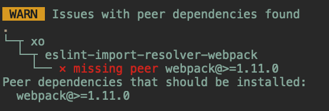

# ignoredep

A placeholder package for ignoring unmatched peerDependency warnings.

For example, `xo` depends on `eslint-import-resolver-webpack` even though I don't use its webpack specific features, resulting in this annoying warning:



With ignoredep, I can simply specify this in my package.json:

```jsonc
{
  "dependencies": {
    // ...
    "webpack": "npm:ignoredep@>=1.11.0",
    // ...
  }
}
```

And the missing peerDependency warning is gone!

`ignoredep` has the versions 0.9999.0 to 25.9999.0 published so you can easily match the major version requirement for any peerDependency.
